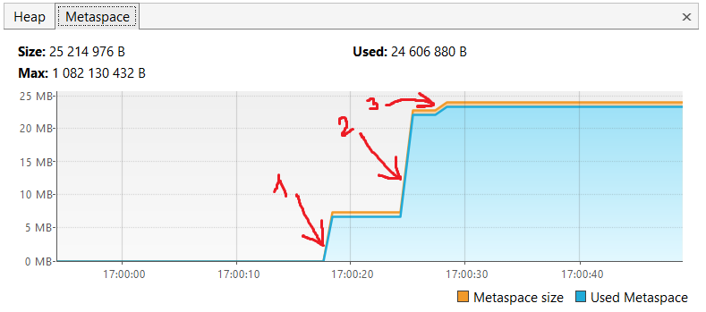
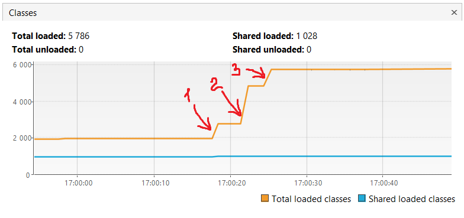
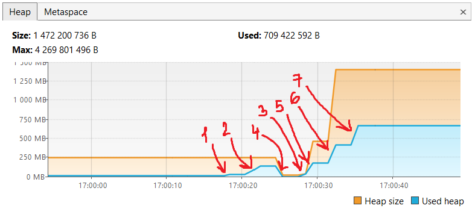

  

  

1) В metaspace были загружены 529 классов из io.vertx, размер metaspace увеличился до 7 МБ. 
   В куче также были созданы экземпляры типа String и LocalTime для вывода в консоль.  
```
17:00:17.876729800: loading io.vertx 
17:00:18.253859200: loaded 529 classes
```
2) В metaspace были загружены еще 2117 классов из io.netty, размер metaspace увеличился до 23 МБ. 
   В куче были добавлены ещё экземпляры типа String и LocalTime для вывода в консоль.
```
17:00:21.268827100: loading io.netty  
17:00:21.988775300: loaded 2117 classes
```
3) В metaspace были загружены 869 классов из org.springframework, размер metaspace увеличился почти до 25 МБ.
   В куче также были созданы экземпляры типа String и LocalTime для вывода в консоль.
```
17:00:24.993740500: loading org.springframework
17:00:25.285001100: loaded 869 classes
```

  
Изначально размер кучи был 250 МБ.  
Точки 1, 2 были описаны выше.  
4) GC почистил в куче неиспользуемые объекты. Размер кучи уменьшился почти до 0 МБ.    

Точка 3 была описана выше.  
5) В куче были созданы 5 млн объектов. Размер кучи увеличился почти до 500 МБ.
```
17:00:28.297540700: creating 5000000 objects
17:00:28.697289900: created
```
6) В куче были созданы еще 5 млн объектов.
```
17:00:31.705306100: creating 5000000 objects
17:00:32.012165100: created
```
7) В куче были созданы еще 5 млн объектов. Размер кучи увеличился до 1400 МБ.
```
17:00:35.073426500: creating 5000000 objects
17:00:35.300875: created
```